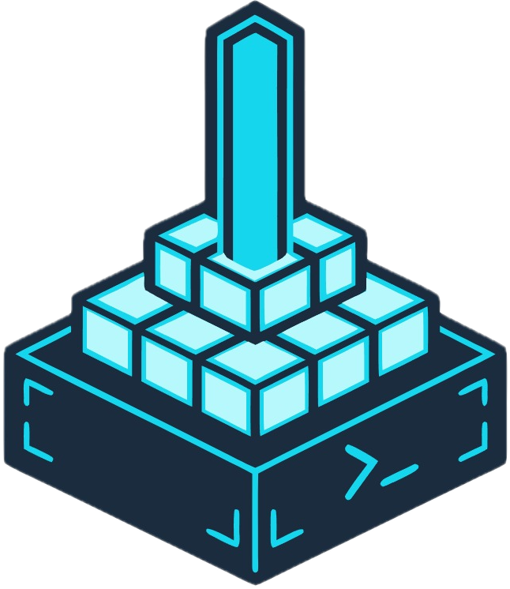

<p align="center">
  
</p>

<h1 align="center">Beacon</h1>

<p align="center">
  Self-hosted server control panel for Laravel, PHP, and Node.js sites — inspired by Laravel Forge, built to run on a single VPS you own.
</p>

<p align="center">
  <a href="DOCS.md">Documentation</a>
  ·
  <a href="#development">Development</a>
  ·
  <a href="#license">License</a>
</p>

---

## Quick install

On Ubuntu 22.04 or 24.04 as root:

```bash
curl -fsSL https://raw.githubusercontent.com/beacon-org/beacon/main/install.sh | sudo bash
```

The installer is interactive. It asks how you want to reach the panel, creates your administrator account, and lets you pick PHP and Node versions. It shows the full plan and waits for confirmation before changing anything on the server.

Without a domain, the panel is available at `https://YOUR_IP:8443` with a self-signed certificate. Attach a real hostname later from **Settings → Server**.

### Unattended installs

Every question can be answered up front. Add `--yes` to run with no interaction:

```bash
curl -fsSL https://raw.githubusercontent.com/beacon-org/beacon/main/install.sh | sudo bash -s -- \
  --domain panel.example.com \
  --email admin@example.com \
  --admin-email admin@example.com \
  --admin-password "$PANEL_PASSWORD" \
  --yes
```

Run `sudo bash install.sh --help` for the full list of flags. If the password is omitted, Beacon generates one and prints it once at the end.

---

## What you get

- **Sites** — Nginx vhosts, per-site PHP-FPM pools, SSL, domains, and isolation controls
- **Deploys** — Git push, polling, or GitHub webhooks with live deployment logs
- **Runtimes** — PHP extensions, Node/Bun versions, Supervisor workers, and cron
- **Data** — MySQL databases, backups, and a site-scoped web console
- **Integrations** — GitHub App for private repos and push-to-deploy
- **Operations** — Activity logging, health checks (`beacon:doctor`), and scheduled backups

---

## Stack

| Layer | Technology |
|-------|------------|
| Backend | Laravel 13, Fortify, Inertia |
| Frontend | React 19, Tailwind CSS v4, TypeScript |
| Server | Nginx, PHP-FPM, MySQL, Redis, Supervisor |
| Panel DB | SQLite (shared state under `/opt/beacon/panel/shared`) |

---

## Development

Requirements: PHP 8.4+, Composer, Node.js 20+, and SQLite (or your configured database).

```bash
composer install
cp .env.example .env
php artisan key:generate
php artisan migrate
npm install
composer run dev
```

Create the first admin user:

```bash
php artisan beacon:create-admin
```

Run the full CI gate locally:

```bash
composer ci:check
```

---

## Documentation

See [DOCS.md](DOCS.md) for backup and restore, security architecture, panel updates, and production operations.

---

## License

MIT
